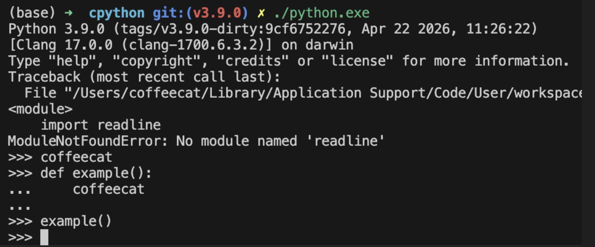

# 编译
```bash
arch -x86_64 /bin/zsh

CPPFLAGS="-I$(brew --prefix zlib)/include" \
LDFLAGS="-L$(brew --prefix zlib)/lib" \
./configure --with-openssl=$(brew --prefix openssl) --with-pydebug

make -j2 -s
```


```bash
./python.exe -V
./python.exe -c "print('ok')"

如果你做的是：

阅读源码
跑不依赖 ssl 的 benchmark
看 ceval / object model / parser / gc / dict / list 等

那现在这个构建已经够用了。
```

# 修改pass关键字

```bash
Grammar/
 ├── Tokens      ← 定义“词法单元长什么样”
 ├── python.gram ← 定义“这些词怎么组成语法”
 └── Grammar     ←（旧版）历史遗留/兼容
```

/Users/coffeecat/workdir/cpython/cpython/Grammar/python.gram
加一个coffeecat作为pass关键字

```bash
make regen-pegen
重新编译
```
成功添加关键字


```bash
(base) ➜  cpython git:(v3.9.0) ✗ python -m tokenize -e test_tokens.py
0,0-0,0:            ENCODING       'utf-8'        
1,0-1,3:            NAME           'def'          
1,4-1,11:           NAME           'example'      
1,11-1,12:          LPAR           '('            
1,12-1,13:          RPAR           ')'            
1,13-1,14:          COLON          ':'            
1,14-1,15:          NEWLINE        '\n'           
2,0-2,4:            INDENT         '    '         
2,4-2,13:           NAME           'coffeecat'    
2,13-2,14:          NEWLINE        '\n'           
3,0-3,0:            DEDENT         ''             
3,0-3,7:            NAME           'example'      
3,7-3,8:            LPAR           '('            
3,8-3,9:            RPAR           ')'            
3,9-3,10:           NEWLINE        '\n'           
4,0-4,0:            ENDMARKER      ''    
```


